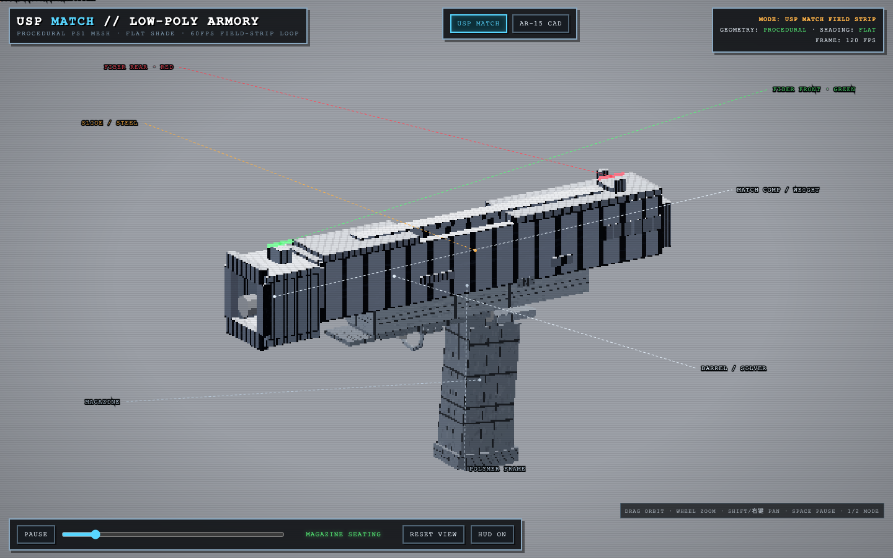
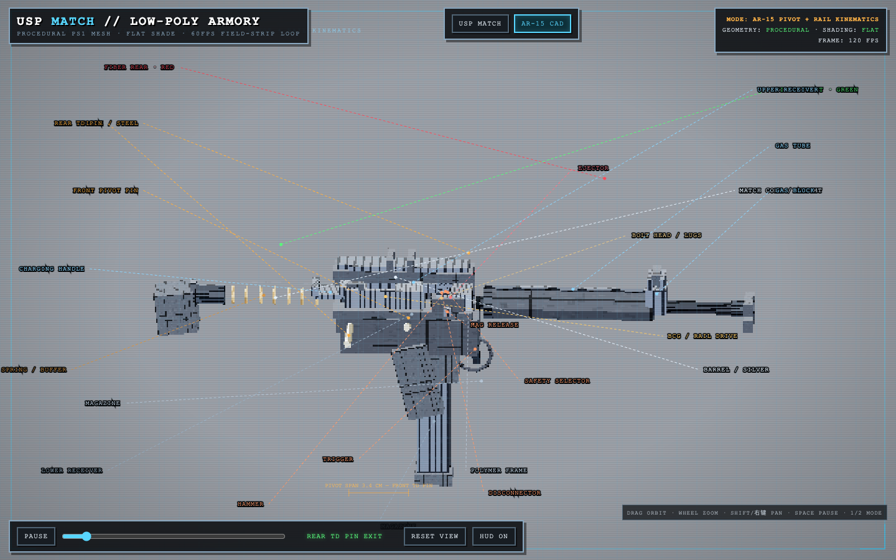
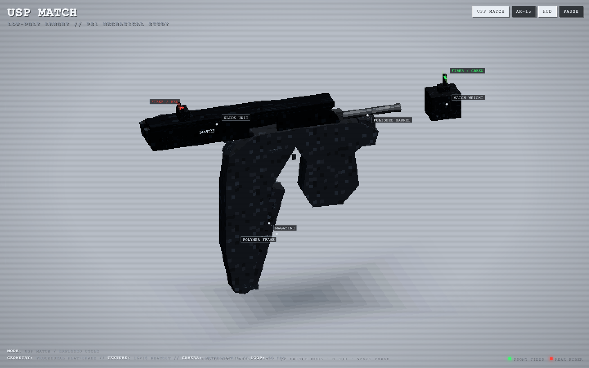
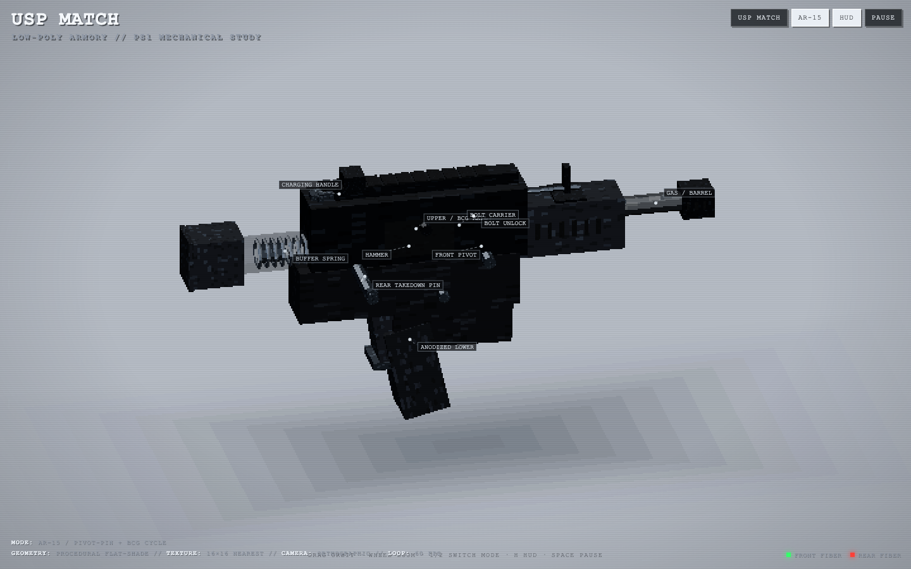
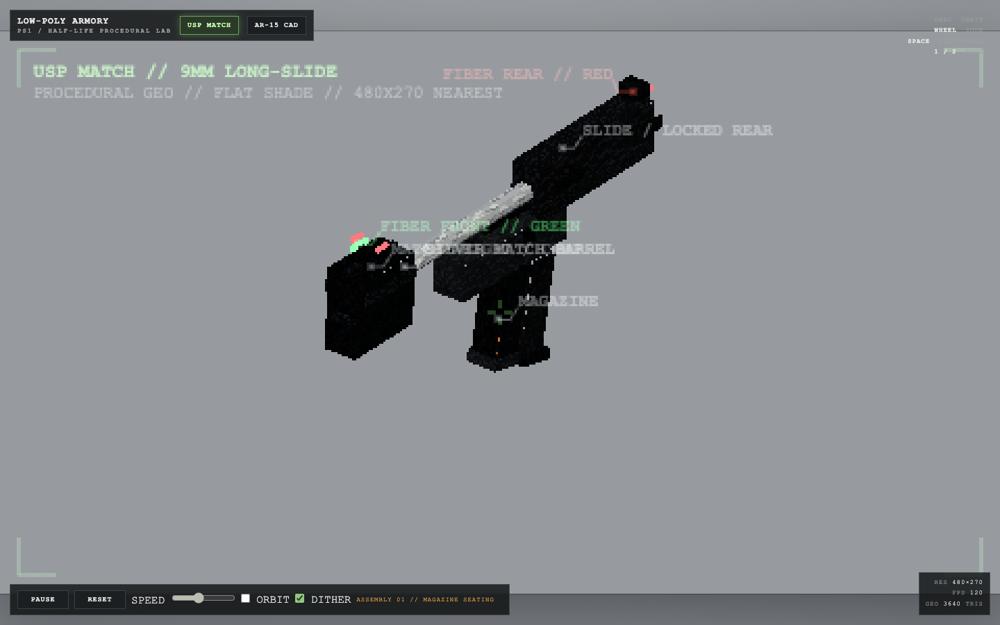
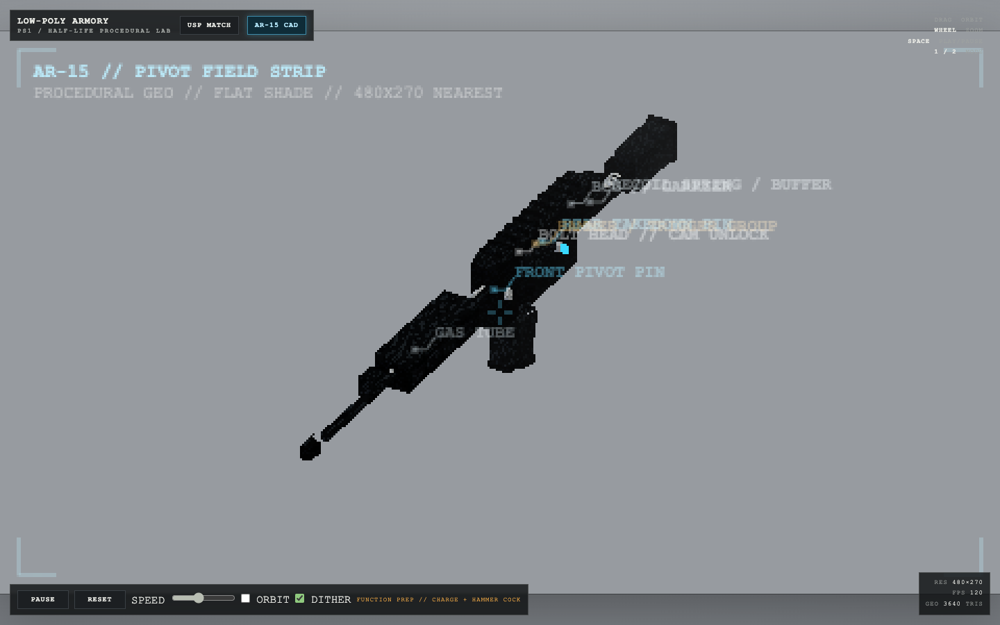

# USP Match 四模式真实模型对比

测试日期：2026-08-16（Australia/Sydney）

这是 APEX v0.3、Minimal Max v0.2、官方 Minimal 和官方 Standard 的一次真实模型 pilot。
每组仅运行一次（`n=1`），因此结果用于发现问题和决定下一轮实验，不用于宣称 APEX 已经
稳定优于其他模式。

## 结论

1. **APEX v0.3：本轮成品质量最佳。** 单 HTML、双击可运行、零 page/tool error，USP 与
   AR-15 的机械细节最丰富。
2. **官方 Minimal：效率/质量平衡最佳。** 四组中最快，零 tool error，视觉完成度接近
   APEX。
3. **Minimal Max v0.2：可以运行，但本轮没有性能优势。** 耗时和 steps 最高，出现 5 个
   tool error，视觉构图也弱于 Minimal 与 APEX。
4. **官方 Standard：运行时失败。** 最终 HTML 在 HTTP 与 `file://` 下均抛出
   `THREE is not defined` 并显示黑屏，同时额外留下一个测试脚本。

## 固定条件

- 四组使用完全相同的[原始提示词](./prompt.md)，SHA-256 为
  `04b18aff68f07c0b65a7934517a9ed3033a1a004f57d6ed60a52412654534c65`。
- Provider/model 均为 `deepseek-official/deepseek-v4-pro`。
- Reasoning effort 为 `max`，`maxTokens=256000`，权限为 `workspace-write`。
- 四组在同一秒提交，分别使用全新 session 与独立空 workspace。
- Minimal Max 与 APEX 的首请求均与官方 Minimal 逐字节一致，仅包含 `bash` 和
  `str_replace_editor`。
- APEX policy 持久事件恰好出现一次。

结构化数据见 [`results.json`](./results.json)。公开记录有意排除了 session ID、本机路径、
原始会话日志和临时依赖目录。

## 生成成本

| 模式 | 用时 | Steps | 输出 tokens | 未缓存输入 | Cache read | Tool errors |
| --- | ---: | ---: | ---: | ---: | ---: | ---: |
| Minimal | 34:16 | 69 | 102,539 | 20,500 | 5,854,080 | 0 |
| Standard | 35:13 | 35 | 136,755 | 48,950 | 4,360,704 | 1 |
| APEX v0.3 | 49:48 | 74 | 117,868 | 33,753 | 6,813,568 | 0 |
| Minimal Max v0.2 | 56:54 | 120 | 121,393 | 31,767 | 11,264,512 | 5 |

相对官方 Minimal，APEX 用时增加 45.3%、steps 增加 7.2%、输出 tokens 增加 14.9%。相对
Minimal Max v0.2，APEX 用时减少 12.5%、steps 减少 38.3%、输出 tokens 减少 2.9%，并将
tool error 从 5 降为 0。

## 浏览器验收

| 模式 | 最终交付 | 双击运行 | Page error | 可见动画 | AR-15 切换 |
| --- | --- | :---: | :---: | :---: | :---: |
| Minimal | 单 HTML，39,597 B | 通过 | 0 | 通过 | 通过 |
| Minimal Max v0.2 | 单 HTML，39,127 B | 通过 | 0 | 通过 | 通过 |
| APEX v0.3 | 单 HTML，48,910 B | 通过 | 0 | 通过 | 通过 |
| Standard | HTML + 测试脚本 | **失败** | `THREE is not defined` | 失败 | 失败 |

工作样本在 120 Hz 测试环境中均达到约 120 次 `requestAnimationFrame` 回调；这只是本机测量，
不代表所有设备上的固定帧率。Standard 虽然仍有回调，但应用初始化已失败，因此不计为动画
通过。

Standard 的根因位于生成结果自身：Three.js CDN 尚未加载时，顶层代码已经创建
`THREE.MeshStandardMaterial`、`THREE.Clock` 和 `THREE.Vector3`。它的源码覆盖度较高，但
实际不能启动，说明静态检查不能替代真实浏览器验收。

## 视觉记录

### APEX v0.3

### 官方 Minimal

### Minimal Max v0.2

### 官方 Standard

## 最终产物

- [APEX v0.3 HTML](./artifacts/apex-v0.3.html)
- [官方 Minimal HTML](./artifacts/minimal.html)
- [Minimal Max v0.2 HTML](./artifacts/minimal-max-v0.2.html)
- [官方 Standard HTML](./artifacts/standard.html)
- [官方 Standard 额外测试脚本](./artifacts/standard-test-anim.cjs)

HTML 文件依赖其生成时选择的 Three.js CDN。GitHub 的源码预览不会执行 HTML；下载后双击
可验证 `file://` 路径。

## 对 APEX 的解释

本轮 APEX 实际只调用了 `bash` 和 `str_replace_editor`，没有调用 `dev_tool_search`。因此，本轮
能够验证 Minimal 首请求锚定、一次性 APEX policy 注入和晋级 catalog，但不能证明
Standard-only 工具为成品质量带来了提升。APEX 相对 Minimal Max 的改进更可能来自精简执行
约束和更稳的执行路径；相对官方 Minimal 的差异仍可能是单样本采样方差。

本轮还暴露出两项下一版约束方向：限制重复验证预算，以及只终止当前任务自己记录的 PID，
禁止 `pkill -f Chromium` 这类宽泛清理。下一步应增加一个必须按需使用 Standard-only 工具的
专门题目，并在平衡顺序下让 APEX 与 Minimal 至少各重复 5 次。
